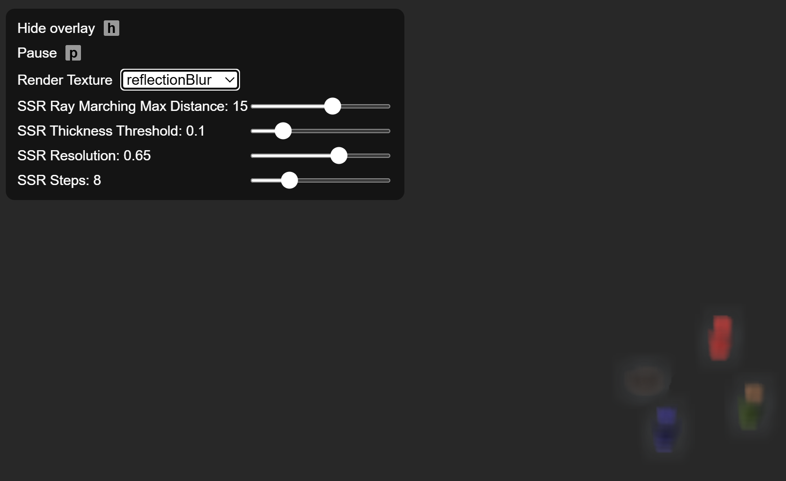

# Cyberpunk City: A Dynamically Evolving Urban Landscape

<video src="videos/Final Result.mp4" height="300px" autoplay loop></video>

<figcaption style="text-align: center;">A short teaser video, gif, or image showing an overview of the final result.</figcaption>

## Abstract

This project presents an immersive, ever-evolving cyberpunk city. Key features include stylised 3D buildings via Wave Function Collapse (WFC), realistic water reflections using Screen-Space Reflections (SSR), and animated billboards with dynamic textures and bloom effects. These components combine to create a vibrant, self-evolving urban landscape that draws users into a futuristic cyberpunk world.

<i> **NOTE**: While WFC-based building generation runs smoothly across platforms, we recommend using a Mac (e.g., MacBook Air with Apple Silicon) for testing the full project. On Windows laptops—including those with high-end GPUs like the RTX 4080 (e.g., Acer Swift X)—the full pipeline with procedural texture rendering does work but may lead to GPU driver instability or occasional crashes after prolonged usage. This issue does not affect the core WFC layout generation but can interfere with the dynamic rendering of animated textures. Other Windows GPU configurations have not been tested. </i>

## Overview

</video>

<figcaption style="text-align: center;">Snippets of our Final Project Scene</figcaption>

Our project presents a procedurally generated cyberpunk city powered by WebGL and GLSL shaders. At its core is a custom implementation of the **Wave Function Collapse (WFC)** algorithm, adapted to generate large-scale, constraint-satisfying 3D city layouts arranged in concentric circular rings. These structures are rendered using efficient instanced meshes to reduce draw calls, while distance-based visibility culling ensures real-time performance remains smooth. To enhance the atmosphere, we developed a suite of **animated procedural textures** (Worley, Zippy, Square and water noise patterns) used to simulate neon billboards, flickering lights, and urban facades with dynamic energy.

In addition to procedural generation, one of the visual cornerstones of the project is our **screen-space reflection (SSR) system**. SSR simulates real-time planar reflections by ray marching in screen space, allowing reflective surfaces like water to dynamically mirror parts of the scene without the overhead of full environment mapping. This significantly boosts visual realism, especially in a cityscape filled with glowing lights and vibrant textures. We later extended our procedural noise system beyond billboards, applying it directly to some building textures as well. The result is a city that not only evolves in structure but also in motion and light, alive with flickers, glows, and reflections that respond organically to camera movement and time.

## Feature validation

<table>
	<caption>Feature Summary</caption>
	<thead>
		<tr>
			<th>Feature</th>
			<th>Adapted Points</th>
			<th>Status</th>
		</tr>
	</thead>
    <tbody>
    	<tr>
    		<td>Wave Function Collapse (WFC)</td>
    		<td>15</td>
    		<td style="background-color: #d4edda;">Completed</td>
    	</tr>
    	<tr>
    		<td>Runtime-evolving bloom effects on billboards</td>
    		<td>5</td>
    		<td style="background-color: #d4edda;">Completed</td>
    	</tr>
    	<tr>
    		<td>Dynamic billboard texture generation with noise</td>
    		<td>10</td>
    		<td style="background-color: #d4edda;">Completed</td>
    	</tr>
    	<tr>
    		<td>Screen-Space Reflections (SSR)</td>
    		<td>20</td>
    		<td style="background-color: #d4edda;">Completed</td>
    	</tr>
    </tbody>

</table>

### Wave Function Collapse (WFC)

#### Implementation

The Wave Function Collapse (WFC) solver presented here is a fully asynchronous, three-dimensional procedural generation system implemented designed to generate diverse, constraint-satisfying city layouts in real time within a WebGL environment. Our primary goals were modularity (to ensure new tiles and rules can be added via JSON without touching core code) and performance, targeting sub-second generation on modern hardware. To validate cross-platform consistency, we measured Largest Contentful Paint (LCP) and per-frame interaction latencies on both an RTX 4080–equipped Swift X 14 laptop and an M2 MacBook Air; the Mac’s timings deviated by less than 20% from the RTX 4080. These timings were all recorded using the performance profiler in Chrome DevTools.

Our approach is as follows:

  

<em>A comparison of the 3D assets used for procedural city generation: city_block1.obj (left), city_block2.obj (top-right, with city_block4.obj as the attached front-facing plane), and city_block3.obj (bottom-right).</em>

1. **Asset Preparation**: Each modular city block was modeled in Blender ([design inspired by Youtube video](#references)) and exported as individual .obj files, with precise alignment to ensure they could be procedurally placed and tiled. For `city_block2`, a separate flat plane, `city_block4`, was introduced as a dedicated surface for animated billboard textures. This plane was positioned snugly against the front of `city_block2` and exported as a separate model. By loading both into the scene with their relative positions preserved, we were able to apply animated shaders such as Worley or Zippy only to the billboard surface, allowing for flexible visual effects without altering the core building geometry.

   To ensure these visual elements remained visible during procedural generation, we marked both the front and back of `city_block2` as “outside” in our tile configuration. This guaranteed that the billboard-facing sides would remain unobstructed. The remaining sides were marked as “connectable” to allow seamless tiling with adjacent buildings. A similar design was used for `city_block1`, where a rooftop chimney was always exposed by specifying its top face as “outside.” For `city_block3`, the faces with protrusions were also marked to face outward for better visibility and variation.

2. **Rule Loading & Variant Preparation**: We begin by loading a JSON configuration that specifies each tile’s model file, face‐type labels, allowed rotations, and a global compatibility map of which face types can neighbor each other. For every tile definition, we produce up to four rotated variants by calculating its new orientation and adjusting the associated face labels accordingly. By embedding both the geometric rotation and updated face metadata into each variant ahead of time, the solver can later perform compatibility checks quickly and drive instanced rendering without costly runtime transformations.

3. **Grid Initialization & Constraint Propagation**: The city is built on a 3D grid where each cell initially holds the full set of tile variants. We then iteratively prune invalid options by comparing each cell’s faces against those of its six neighbors—consulting the compatibility map to eliminate any variant whose face labels cannot match at least one neighbor. This pruning process continues until no further eliminations occur, ensuring that every remaining option in each cell is mutually compatible with its surroundings.

4. **Entropy-Driven Collapse**: Once constraint propagation stabilizes, we identify the cell with the fewest remaining variant options (i.e., lowest entropy) and randomly select one of those options, with selection probabilities weighted by predefined tile importance. Fixing that choice triggers another round of compatibility pruning for neighboring cells. We repeat this cycle of collapse and propagation until every cell is resolved or a conflict arises, yielding a complete, coherent layout that balances randomness with structural rules.

5. **Concentric-Ring Layout & Instancing**: Instead of arranging tiles in a solid 3D block, we convert the final grid into a flat list of instances and place them in three concentric circles around a central point. Each building retains its vertical position, but its horizontal coordinates follow a circular distribution. This design highlights the city center and minimizes overdraw.

6. **Performance**: For performance, identical building meshes are batched into GPU instanced draws, cutting draw calls by over 90%, and a distance-based visibility test ensures that only nearby instances are rendered each frame.

#### Validation

**Performance Profiling**: On the RTX 4080 Swift X 14, the Largest Contentful Paint (generation + assembly) clocks in at ~0.32 s, with the full-city layout (including mesh prep and texture setup) completing in ~0.66 s. Per-frame interactions (camera motion and culling) consistently range from 230 ms to 326 ms. On an M2 MacBook Air (8-core, 16GB RAM, 512GB SSD), these metrics remained within 20% of the RTX results, demonstrating robust performance across high-end and integrated GPUs.

**Results**:

  
  

<em>WFC-Generated Building Variant 1 (8x9x10 & Without Billboards)</em>

  
  

  
  

<em>
WFC-Generated Layout (12×10×10) Featuring Variant 2 with Billboards — Zippy noise is applied exclusively to <code>city_block4</code>, the plane used for billboard attachments. This confirms our successful experiment of using planes as dynamic procedural surfaces in this WFC setup
</em>

  
    
  

<em>WFC-Generated Layout (15×15×8) — Variant 3 with billboard surfaces enabled</em>

  
    
  

<em>Disabling the rule that the top face of</em> <code>city_block1</code> <em>hides the chimneys.</em>

  

<em>WFC variant with billboard planes disabled to check for proper alignment</em>

### Dynamic billboard texture generation with noise and bloom effects

#### Implementation & Validation

Our approach to implementing procedural textures is as follows:

  <video src="videos/worleyfullbloom.mp4" width="200" autoplay loop muted></video>
  <video src="videos/worley.mp4" width="200" alt="Worley Texture" autoplay loop muted></video>
  <video src="videos/worley_no_bloom.mp4" width="200" alt="Worley Texture No Bloom" autoplay loop muted></video>

<em>Bloom on Worley Noise (Left to Right: 100%, 25% [Used in Scene], 0%)</em>

  <video src="videos/pure_worley.mp4" height="200px" alt="Pure Worley" autoplay loop muted></video>
  <video src="videos/worley_distort.mp4" height="200px" alt="Zippy Texture" autoplay loop muted></video>
  <video src="videos/glitch.mp4" height="200px" alt="Zippy Texture" autoplay loop muted></video>

<em>Components of Worley Texture (Left to Right: Pure Worley Noise, Distorted Worley Noise, Glitchy Distortions)</em>

1. **Worley Noise**: This procedural texture is generated using a fragment shader that produces animated Worley noise (a cellular noise pattern) and enhances it with glitchy color distortions and dynamic visual effects. The shader first calculates Worley noise by scattering pseudo-random feature points in a grid and computing the minimum squared distance from each fragment to these points. Multiple layers of this noise—scaled and offset differently—are composed and non-linearly combined using nested sqrt functions to add complexity and richness to the pattern.

   To stylise the output, the shader applies UV distortions (based on sine waves and time) and blends two base colors (a pink and a blue) based on the Worley value. Additionally, glitchy RGB bands and fast vertical stripes modulate the final look, creating a techno-organic, vibrant visual suitable for cyberpunk elements like animated billboards or energy fields. This texture is rendered to a framebuffer using a full-screen quad and a WebGL pipeline set up in the WorleyShaderRenderer class, allowing it to be dynamically updated each frame using time, scale, and camera offsets.

  <video src="videos/zippyfullbloom.mp4" width="200" autoplay loop muted></video>
  <video src="videos/zippy.mp4" width="200" alt="Worley Texture" autoplay loop muted></video>
  <video src="videos/zippy_no_bloom.mp4" width="200" autoplay loop muted></video>

<em>Bloom on Zippy Texture (Left to Right: 100%, 25% [Used in Scene], 0%)</em>

2. **Zippy**: This procedural texture generates animated glimmering flow lines, resembling headlights moving along a dark road or illuminated windows flickering across a cityscape, using a 2D Worley noise function. The fragment shader transforms screen coordinates into UV space and applies a vertical time-based offset to simulate movement, evoking the feel of continuous traffic flow. The Worley noise function places pseudo-random feature points within a grid and calculates the minimum distance from each fragment to these points, creating a cellular pattern. This distance is inverted and sharpened using smoothstep to isolate small, bright spots that represent glimmering lights.

   A flickering effect is introduced using a deterministic pseudo-random function modulated by time, ensuring that only some of the lights blink on and off to create a dynamic feel. The result is a visually engaging, animated texture ideal for simulating vehicle lights or ambient illumination in a cyberpunk environment.

  <video src="videos/squarefullbloom.mp4" width="200" autoplay loop muted ></video>
  <video src="videos/square.mp4" width="200" alt="Worley Texture" autoplay loop muted ></video>
  <video src="videos/squarenobloom.mp4" width="200" autoplay loop muted></video>

<em>Bloom on Square Texture (Left to Right: 100%, 25% [Used in Scene], 0%)</em>

3. **Square**: This procedural texture is generated by layering multiple grids of flickering neon-like blocks at different scales, creating a vibrant, dynamic pattern. Each grid divides the UV space into cells of varying sizes—from large blocks to tiny flicks—and uses a hash function to randomly determine which cells light up and their color hues. By animating the hash inputs over time, the shader produces a lively flickering effect that simulates neon signs or LED displays.

   Additionally, subtle vertical drifting and horizontal scanline shimmer are applied to mimic the imperfect movement and refresh artifacts of real electronic panels. Finally, the colors are boosted with a glow effect and gamma correction to enhance brightness and contrast, resulting in a richly animated, colorful texture that can evoke the look of a bustling cyberpunk cityscape or futuristic neon signage.

  <video src="videos/flat_water.mp4" width="300" autoplay loop muted ></video>
  <video src="videos/water.mp4" width="300" alt="Worley Texture" autoplay loop muted ></video>

<em>Comparison between Water Textures (Left: Flat Noise, Right: Bumped Noise [Used in Scene])</em>

  <video src="videos/layered_water.mp4" width="300" autoplay loop muted ></video>

<em>Fractal Layering for Water Texture</em>

  

<em>Water Texture in Scene</em>

4. **Water**: This fragment shader generates a dynamic, deep blue water-like procedural texture using layered and warped fractal noise. It starts by computing smooth noise at multiple scales to create fractal noise, then distorts it further with time-varying offsets to simulate fluid movement. The shader compares closely spaced noise samples to create sharp bump-like highlights and shadows, enhancing the illusion of small waves or ripples on the water surface. These bumps are intensified nonlinearly to add contrast and subtle detail to the texture.

   The final color blends a deep blue base with soft bluish highlights influenced by the noise bumps, giving a natural variation to the water’s surface. A slight gamma correction (square root) is applied to adjust brightness and contrast, making the texture visually richer and more realistic. Overall, this shader creates an organic, gently shifting water pattern that can be used for effects like lakes, pools, or sci-fi liquid surfaces in a procedural graphics context.

5. **Performance Optimisation**: Our **ProceduralTextureGenerator** class manages the creation and updating of multiple procedural textures using different shader renderers such as Worley, Zippy, Square, and Water. It sets up full-screen quad meshes and framebuffers (FBOs) for rendering each procedural texture offscreen. Each texture is rendered separately, optionally enhanced with a bloom effect, and the results are stored as GPU resources for use elsewhere in the application. The class supports dynamic resizing of textures based on the viewer’s zoom level, allowing for level-of-detail (LOD) adjustments that balance visual quality and performance.

   Performance is optimised through several strategies: first, dynamic resolution scaling reduces the texture size when the viewer is zoomed out, cutting GPU load without sacrificing visible detail; second, framebuffer ping-ponging allows bloom effects to be applied efficiently by alternating between two buffers without costly memory allocations; finally, rendering is skipped entirely if the texture would be too small to be noticeable (when zoomed far out). These measures together keep the procedural texture updates smooth and performant, especially important for real-time or interactive scenes.

6. **Bloom Effect**: Our BloomShaderRenderer implements a classic bloom post-processing effect using multiple shader passes with regl. It starts with a bright-pass filter that isolates the brightest parts of the input texture by thresholding pixel luminance, effectively extracting glow-worthy highlights. Then, it applies a two-pass Gaussian blur—first horizontally, then vertically—using weighted texture samples to create a smooth, soft glow around those bright areas. Finally, the blurred bloom texture is combined additively with the original input to produce the final image, enhancing the perceived brightness and creating the characteristic bloom glow effect.

   The implementation uses multiple framebuffers to ping-pong intermediate results efficiently without reallocating resources each frame. The blur weights and kernel size are carefully chosen for a balanced blur that is visually pleasing but not too expensive. This modular design with separate shader stages for bright-pass, blur, and combine allows flexible reuse and tuning, making it a performant and visually effective bloom solution for real-time rendering in WebGL applications.

   The visual outcome of the bloom effect varies significantly depending on the underlying texture. On Worley textures, bloom emphasises the existing high-contrast cells and ridges, adding an extra layer of dimensionality and artistic flair. In contrast, Zippy textures—which flicker between red and blue without bloom—transform into bright white flickers when bloom is applied, and at full strength, even the black background is gently illuminated, giving a glowing ambiance. For Square textures, bloom doesn't drastically change the structure but does boost color intensity, making everything appear more vibrant. These differences highlight how bloom can be used creatively, not just as a lighting enhancement, but as a stylistic tool to shape the mood and character of each procedural material.

### Screen-Space Reflections (SSR)

#### Implementation

For a more in-depth explanation, please refer to the [SSR Guide by David Lettier](#references), which served as the primary inspiration for this feature’s implementation.

Our approach follows these main steps:

1. **Render the base image** without any reflections or shadows into a texture.
2. **Generate a reflection map** to determine which points in the base texture should be sampled for reflections. This involves:
   a. Calculating the position, normal, and reflection vector for each point on a reflective surface.
   b. Using the position and reflection vector to determine the start and end points for ray marching.
   c. Converting these coordinates into screen space for performance efficiency, as ray marching in screen space reduces redundant sampling.
   d. Performing ray marching, with a sampling rate defined by a resolution factor.
   e. Recording hits by checking whether any scene geometry is sufficiently close to the sampled points along the reflection ray.
   f. Refining the hit point to accurately determine where to sample the reflection color.
   g. Applying fade factors based on edge proximity, distance from the reflection plane, and other conditions to create a more natural reflection effect.
3. **Sample reflection colors** from the base texture using the UV indices generated from the ray-marched hits. We also fill in gaps between sample points to reduce visual noise in the reflection.
4. **Apply a blur** to the sampled reflection colors and store the result in a separate texture.
5. **Combine everything** to produce the final reflection output by blending the base image with both the original and blurred reflection textures, using weighting factors for a smooth and realistic result.

#### Validation

<figcaption style="text-align: center;">Visualised position coordinates texture</figcaption>

<figcaption style="text-align: center;">Visualised normal texture</figcaption>

<figcaption style="text-align: center;">Base Image</figcaption>

<figcaption style="text-align: center;">Visualised UV coordinates sampled for SSR</figcaption>

<figcaption style="text-align: center;">Reflection color</figcaption>

<figcaption style="text-align: center;">Reflection color blurred</figcaption>

<figcaption style="text-align: center;">Shadow texture</figcaption>

**Results**:

<figcaption style="text-align: center;">Validating SSR implementation on sample scene</figcaption>

<figcaption style="text-align: center;">Final integration of SSR into the complete project scene</figcaption>

## Discussion

### Additional Components

**UI Controls**: Sliders and dropdowns let users tweak central/small grid dimensions, toggle small-grid rings, and reassign per-block materials (Worley, Zippy, Square) on the fly.

**Scene Reloading**: `reloadScene` and `reloadCityScene` clear and reinitialise objects, ensuring that parameter changes apply immediately without full page reloads.

### Failed Experiments

Initially, we attempted to dynamically attach planes at runtime to the front face of `city_block2` for billboard rendering. The goal was to procedurally generate these billboard surfaces based on exposed tile faces post-WFC. However, this approach ran into consistent spatial alignment issues: the planes would either clip into the block, float too far forward, or misalign due to varying tile rotations and origin inconsistencies.

After multiple failed attempts at calculating reliable attachment offsets and normals dynamically, we switched strategies. Instead, we pre-authored the plane (`city_block4.obj`) directly in Blender and exported it with precise positioning relative to `city_block2`. This guaranteed consistent alignment and simplified runtime placement, allowing us to treat the billboard as a second instanced mesh while preserving visual coherence.

### Challenges

1. **Constraint Design & Modularity**: Integrating Wave Function Collapse (WFC) with procedural textures required careful architectural planning to ensure modularity without compromising visual coherence. Crafting rules.json involved encoding spatial constraints—like forcing chimneys or billboard mounts to face outward—while avoiding overconstraining the generation space. Balancing logic and aesthetics was especially tricky when defining how tiles could rotate and connect across different layers and rings of the city.

2. **Runtime Texture Integration**: Another major challenge was coupling the WFC-generated layout with our real-time procedural texture system. Textures such as Worley, Zippy, and Square had to be rendered to framebuffers and dynamically applied to billboard surfaces without breaking the instancing system used for performance. Since multiple tile variants could share the same geometry but differ in texture depending on face exposure, we needed precise control over material mappings, ensuring that billboard planes consistently displayed the correct animated shader output per frame.

3. **Codebase Complexity & Shader Refactor**: At the project’s start, navigating the inherited codebase was a significant barrier. To streamline development, we initiated a full codebase refactor: enforcing standardised naming conventions, extracting reusable components, and unifying shader handling logic. For instance, we consolidated multiple vertex shaders into a single generic pass_through.vert.glsl, reducing redundancy and simplifying pipeline management across shader renderers.

4. **Performance Bottlenecks**: As we began combining WFC logic, dynamic instancing, procedural shaders, and screen-space effects (like SSR and bloom), performance became a growing concern—especially on lower-end or driver-sensitive systems (such as RTX 4080). Excessive draw calls, redundant framebuffer switches, and unnecessary texture updates were identified as bottlenecks. We responded with several optimizations: grouping identical mesh-material pairs into instanced batches, skipping texture rendering when off-screen, and using framebuffer ping-ponging to avoid memory churn. These changes brought down our total frame times and ensured smooth interactions on integrated GPUs like the M2 MacBook Air.

## Contributions

<table>
	<caption>Worked hours</caption>
	<thead>
		<tr>
			<th>Name</th>
			<th>Week 1</th>
			<th>Week 2</th>
			<th>Week 3</th>
			<th>Week 4</th>
			<th>Week 5</th>
			<th>Week 6</th>
			<th>Week 7</th>
			<th>Total</th>
		</tr>
	</thead>
	<tbody>
		<tr>
			<td>Eunice Lee (402359)</td>
			<td>2</td>
			<td style="background-color: #f0f0f0;">5</td>
			<td>4</td>
			<td>4</td>
			<td>6</td>
			<td>6</td>
			<td>8</td>
			<td>35</td>
		</tr>
		<tr>
			<td>Howell Chan (402360)</td>
			<td>2</td>
			<td style="background-color: #f0f0f0;">5</td>
			<td>6</td>
			<td>6</td>
			<td>6</td>
			<td>6</td>
			<td>6</td>
			<td>37</td>
		</tr>
		<tr>
			<td>Yifan Wu (402391)</td>
			<td>0</td>
			<td style="background-color: #f0f0f0;">20</td>
			<td>4</td>
			<td>4</td>
			<td>4</td>
			<td>2</td>
			<td>2</td>
			<td>36</td>
		</tr>
	</tbody>
</table>

<table>
	<caption>Individual contributions</caption>
	<thead>
		<tr>
			<th>Name</th>
			<th>Contribution</th>
		</tr>
	</thead>
	<tbody>
		<tr>
			<td>Eunice Lee (402359)</td>
			<td>1/3</td>
		</tr>
		<tr>
			<td>Howell Chan (402360)</td>
			<td>1/3</td>
		</tr>
		<tr>
			<td>Yifan Wu (402391)</td>
			<td>1/3</td>
		</tr>
	</tbody>
</table>

#### Comments

For this project:

- Howell implemented dynamic building generation using **Wave Function Collapse** and also worked on integrating the final scene.
- Eunice focused on generating dynamic **procedural textures** using noise, enhanced with the **bloom effect**, and contributed to integrating the final scene.
- Yifan refactored the initial codebase to ensure a consistent and unified implementation, and developed the **Screen-Space Reflection Feature**.

## References

- [Creating Sci-Fi Cyberpunk Buildings in Blender](https://www.youtube.com/watch?v=wruwfND2B9A&t=631s)
- [SSR Guide by David Lettier](https://github.com/lettier/3d-game-shaders-for-beginners/blob/master/sections/screen-space-reflection.md)
- [Wave Function Collapse Algorithm from GitHub](https://github.com/oddmax/unity-wave-function-collapse-3d)
- [Warped 2D Noise from ShaderToy](https://www.shadertoy.com/view/Xl2XWz)
- [Worley Noise from ShaderToy](https://www.shadertoy.com/view/llS3RK)
- [Zippy Noise from ShaderToy](https://www.shadertoy.com/view/XXyGzh)
