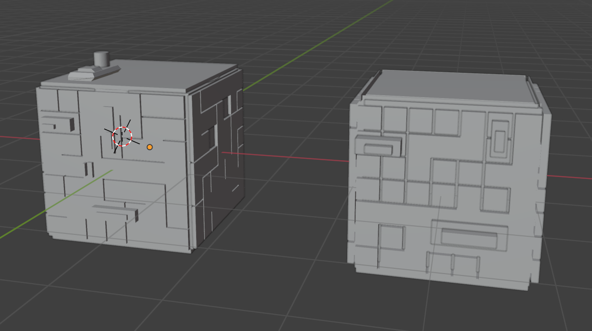
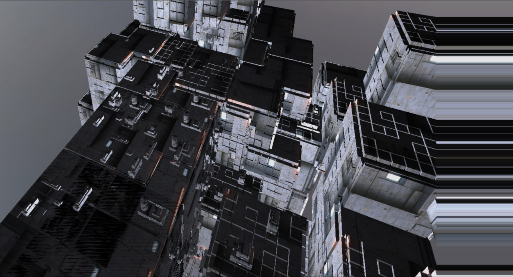
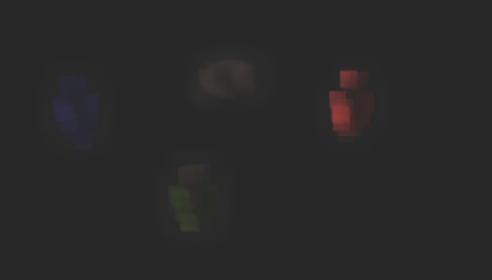
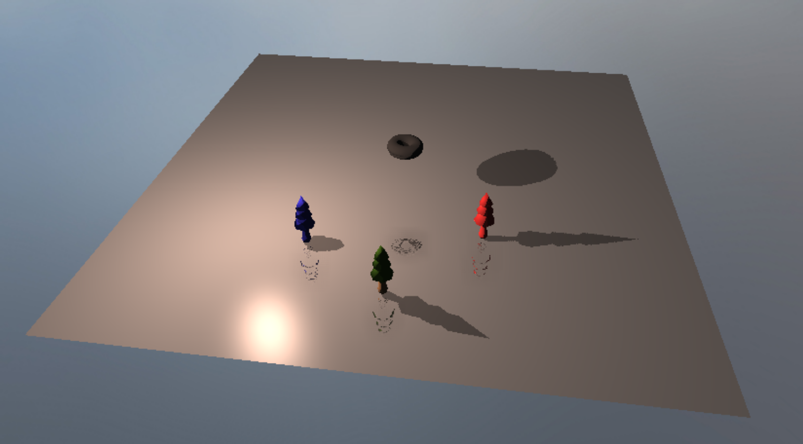

## **Cyberpunk City: A Dynamically Evolving Urban Landscape**

### Progress Summary

<table>
	<thead>
		<tr>
			<th>Feature</th>
			<th>Adapted Points</th>
			<th>Status</th>
		</tr>
	</thead>
	<tbody>
		<tr>
			<td>Runtime-evolving bloom effects on billboards</td>
			<td>5</td>
			<td style="background-color: #cce5ff;">Upcoming</td>
		</tr>
		<tr>
			<td>Dynamic billboard texture generation with noise</td>
			<td>10</td>
			<td style="background-color: #fff3cd;">Work in progress</td>
		</tr>
		<tr>
			<td>Wave Function Collapse (WFC)</td>
			<td>15</td>
			<td style="background-color: #fff3cd;">Work in progress</td>
		</tr>
		<tr>
			<td>Screen-Space Reflections (SSR)</td>
			<td>20</td>
			<td style="background-color: #fff3cd;">Work in progress</td>
		</tr>
	</tbody>
</table>

### Achieved Goals

<table>
 	<tr>
 		<th></th>
 		<th>Eunice Lee</th>
 		<th>Howell Chan</th>
 		<th>Yifan Wu</th>
 	</tr>
 	<tr>
 		<td>Week 1 (Proposal)</td>
 		<td>Prototype procedural noise; start HDR pipeline</td>
 		<td>Design building tile sets and rules; plan UI</td>
 		<td>—</td>
 	</tr>
 	<tr style="background-color: #f0f0f0;">
 		<td>Week 2 (Easter)</td>
 		<td>Bright pass filter</td>
 		<td>Implement 2D WFC; build seed parameter UI</td>
 		<td>Learn about SSR, implement SSR with texture maps</td>
 	</tr>
 	<tr>
 		<td>Week 3</td>
 		<td>Enhance texture evolution</td>
 		<td>Map 2D layouts to 3D; refine seed UI</td>
 		<td>Refactor code base</td>
 	</tr>
	<tr>
 		<td>Week 4</td>
 		<td></td>
 		<td></td>
 		<td>Fine-tune reflections</td>
 	</tr>
 </table>

### Preliminary Results

- **Dynamic Billboard Texture with Noise**

{width="500px"}

- **Wave Function Collapse (WFC)**

| Stage            | Screenshot                                                      |
| ---------------- | --------------------------------------------------------------- |
| Starting Mesh    | {width="500px"}       |
| Generated Mesh 1 | {width="500px"} |
| Generated Mesh 2 | {width="500px"} |

- **Screen-Space Reflections (SSR)**

| Description         | Screenshot                                                       |
| ------------------- | ---------------------------------------------------------------- |
| Normal Map          | {width="500px"}          |
| Reflection UV Map   | {width="500px"}               |
| Reflected Colors    | {width="500px"}  |
| Blurred Reflections | {width="500px"} |
| Final Scene         | {width="500px"}            |

We have individually implemented key components and will continue to improve their fidelity and performance before integrating them into a cohesive scene.

### Feature Validation

- Screen-Space Reflections (SSR)

  - **Implementation Details**

    Our SSR approach follows David Lettier's screen-space ray-marching technique. We project rays in screen-space and identify reflection hits using thresholds on depth proximity. Several parameters control ray-marching precision and early exits for performance.

  - **Validation**

    While the implementation is functional (See above images), reflection accuracy is currently a trade-off: tighter thresholds result in incomplete reflections, while looser ones cause smeared or noisy visuals. Work is ongoing to tune these margins.

### Worked Hours

| **Week**          | **Eunice Lee** | **Howell Chan** | **Yifan Wu** |
| ----------------- | -------------- | --------------- | ------------ |
| Week 1 (Proposal) | 2 hours        | 2 hours         | 0 hours      |
| Week 2 (Easter)   | 5 hours        | 5 hours         | 20 hours     |
| Week 3            | 4 hours        | 6 hours         | 4 hours      |
| Week 4            | 4 hours        | 6 hours         | 4 hours      |

### Project Reflection

The project is progressing according to our initial plan. Most key systems have been implemented in functional form. We expect to spend the upcoming weeks polishing and integrating our modules. The initial workload estimates were broadly accurate, although some areas (e.g., SSR) required more exploration and time than anticipated.

### Schedule Update

**Acknowledgement of Delays**

Progress has generally been steady. However, further refinement of existing features (particularly SSR and WFC) may lead to slight delays.

**Revised Plan for Remaining Weeks**

| **Week** | **Eunice Lee**                               | **Howell Chan**                           | **Yifan Wu**                              |
| -------- | -------------------------------------------- | ----------------------------------------- | ----------------------------------------- |
| Week 5   | Build project scene; implement bloom effects | Build project scene                       | Build project scene                       |
| Week 6   | Finalize scene; test integration             | Finalize scene; test integration          | Finalize scene; test integration          |
| Week 7   | Prepare final presentation and demo video    | Prepare final presentation and demo video | Prepare final presentation and demo video |
