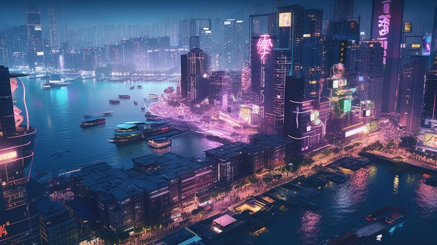
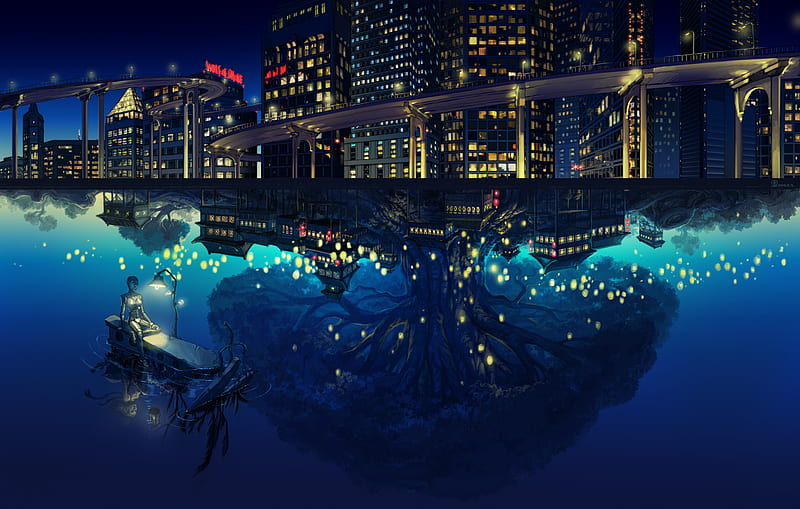
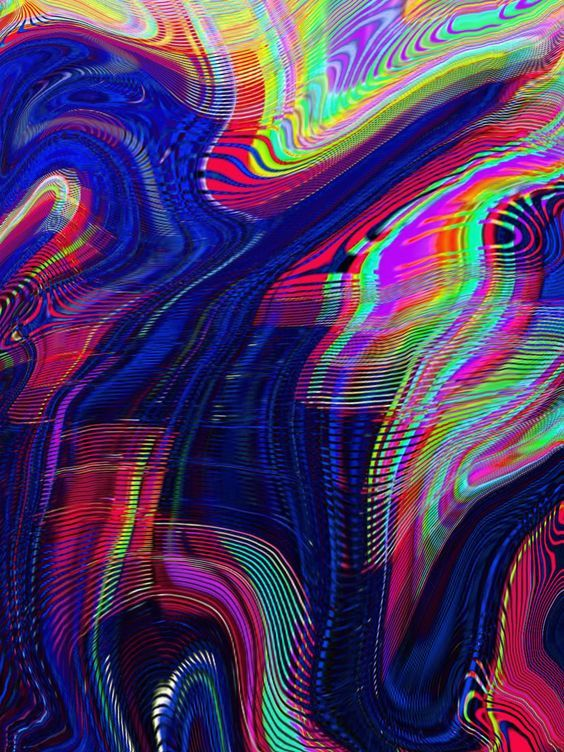

# Cyberpunk City: A Dynamically Evolving Urban Landscape

## Abstract

This project aims to create an immersive, ever-changing cyberpunk city scene using advanced procedural content generation (PCG) and real-time rendering techniques. The city will evolve dynamically at runtime with procedurally generated 3D buildings and continuously changing billboard texture art. It is split across three main technical contributions:

- **Wave Function Collapse (WFC)** algorithm for generating diverse, stylized 3D buildings (Howell),
- **Screen-Space Reflections (SSR)** for realistic water-based reflections (Yifan),
!(images/texture_demo1.jpg){width="150px"}
- **Dynamic procedural textures and bloom effects** for animated billboard visuals (Eunice).

These components form a cohesive, visually rich urban environment that evolves on its own and reflects the vibrance of a futuristic city.

## Technical Overview

### Wave Function Collapse (WFC) for Procedural 3D Building Generation (Howell)

**Objective:**  
Use the WFC algorithm to generate a diverse collection of 3D buildings with unique architectural details that fit within a cyberpunk style.

**Technical Overview:**

- Develop a library of building tiles and modules (including windows, doors, balconies, neon panels, etc.) with defined connection rules to ensure coherent assembly.
- Implement the WFC algorithm to generate 2D grid layouts representing building facades through constraint propagation and iterative collapse.
- Map 2D layouts into 3D space by extruding the layouts into full building models, incorporating stochastic variations in height, floor count, and details.
- Implement a simple UI that allows real-time manipulation of seed parameters (such as randomization seeds and probability weights) to control and vary the generated city’s architectural style throughout runtime.
- The UI will immediately regenerate the layout based on new seed input, enabling experimentation and exploration of different urban aesthetics with minimal delay.

### Screen-Space Reflections (SSR) for Water-Based Reflections (Yifan)

**Objective:**  
Create a water body that produces realistic screen-space reflections of the surrounding buildings and environment, enriching the cyberpunk atmosphere.

**Technical Overview:**

- Develop a reflective water surface using custom shaders that leverage the scene’s G-buffer containing depth and normal data.
- Implement a screen-space reflection technique based on ray marching, sampling the surroundings to generate accurate reflective effects on the water surface.
- Adjust reflection parameters based on water surface movement.
- Optimize the reflection shader for real-time performance, ensuring seamless integration with overall scene lighting and other post-processing effects.

### Dynamic Procedural Textures and Bloom for Billboard Art and Lighting (Eunice)

**Objective:**  
Create dynamic procedural textures for billboard art that continuously evolve during runtime, and integrate bloom effects to enhance the neon glow on billboards without relying on manual slider adjustments.

**Technical Overview:**

- Use noise algorithms such as Worley or Gabor noise to generate intricate, non-repeating procedural textures that simulate futuristic billboard art, including elements like neon circuitry, holographic patterns, and weathered surfaces.
- Instead of static slider controls, design the shader code to automatically and continuously modify noise parameters (frequency, amplitude, movement, etc.) over time. This produces ever-changing visual art on billboards, simulating a dynamic advertising environment in the city.
- Integrate an HDR-based bloom effect into the rendering pipeline.
  - Implement a bright pass filter to isolate the high-intensity areas on billboards.
  - Apply multi-pass Gaussian blur to create a soft, luminous glow that is composited over the scene.
- Ensure that the dynamic changes in billboard textures, combined with the glowing bloom effect, enhance the overall ambiance by synchronizing with the urban lighting and reflective surfaces in the scene.

## Features

| Feature                                              | Points | Adapted Points |
|------------------------------------------------------|--------|----------------|
| Procedural generation of 3D buildings via WFC        | 20     | 15             |
| Real-time screen-space reflections using SSR         | 20     | 20             |
| Dynamic billboard texture generation with noise      | 10     | 10             |
| Runtime-evolving bloom effects on billboards         | 5      | 5              |

## Schedule

<table>
	<tr>
		<th style="width: 20%"></th>
		<th>Howell</th>
		<th>Yifan</th>
		<th>Eunice</th>
	</tr>
	<tr>
		<td>Week 1</td>
		<td>Design building tile sets and rules; plan UI</td>
		<td>Set up water shader; prototype SSR basics</td>
		<td>Prototype procedural noise; start HDR pipeline</td>
	</tr>
	<tr>
		<td>Week 2 (Easter)</td>
		<td>Implement 2D WFC; build seed parameter UI</td>
		<td>Implement SSR using depth/normal maps</td>
		<td>Bright pass filter + Gaussian blur for bloom</td>
	</tr>
	<tr>
		<td>Week 3</td>
		<td>Map 2D layouts to 3D; refine seed UI</td>
		<td>Optimize SSR performance</td>
		<td>Enhance texture evolution; sync with bloom</td>
	</tr>
	<tr>
		<td>Week 4</td>
		<td>Integrate 3D buildings into city scene</td>
		<td>Fine-tune reflections and integration</td>
		<td>Finalize textures and smooth transitions</td>
	</tr>
	<tr>
		<td>Week 5</td>
		<td colspan="3">Full system integration, scene tuning, and bug fixing</td>
	</tr>
	<tr>
		<td>Week 6</td>
		<td colspan="3">UI polish and final testing; performance profiling</td>
	</tr>
	<tr>
		<td>Week 7</td>
		<td colspan="3">Final integration and QA; prepare presentation</td>
	</tr>
</table>

## Resources
- https://github.com/Primarter/WaveFunctionCollapse
- https://github.com/whaoran0718/3dDungeonGeneration
- https://github.com/MaxHalford/procedural-art
- https://github.com/marian42/proceduralart 
- https://medium.com/@soham_saha/experimenting-with-procedural-art-c0ef91908f4d
- https://github.com/JyarlJung/GodotWaterShader
- https://lettier.github.io/3d-game-shaders-for-beginners/screen-space-refraction.html
- ShaderToy or GLSL/Unity Shader Graph references for SSR and bloom
- Research papers on Wave Function Collapse (e.g., Gumin’s model)
- High-resolution cyberpunk textures and modular building assets
- GitHub for version control and collaboration

